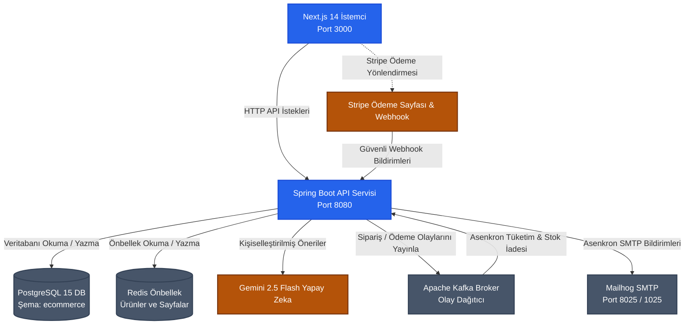

# 🛒 Modern Olay Güdümlü (Event-Driven) E-Ticaret Ekosistemi

Bu proje; **Spring Boot 3**, **Next.js 14 (App Router)**, **Apache Kafka**, **Redis** ve **PostgreSQL** kullanılarak geliştirilmiş, yüksek performanslı, konteynerize (Dockerized) ve olay güdümlü bir e-ticaret platformudur. Platform, **Stripe Checkout** ile güvenli ödeme akışlarını, **Gemini AI** destekli gerçek zamanlı ürün önerilerini ve asenkron arka plan e-posta bildirimlerini içerir.

---

## 📺 Proje Demo Videosu & Mimari Farkındalık Notu

> [!NOTE]
> **Neden Canlı Dağıtım Linki Yerine Demo Video Sunuluyor?**
>
> Bu ekosistem; **Apache Kafka** olay dağıtıcısı ve **Redis** önbellek katmanı gibi gerçek dünya üretim (production) seviyesinde altyapı bileşenleri barındırmaktadır. 
> 
> Ücretsiz veya düşük bütçeli bulut platformlarının (Render, Neon, Upstash vb.) sunduğu **"uyku modu / soğuk başlangıç (cold start)"** kısıtlamaları, servislerin uyanmasında gecikmelere (60+ saniye) ve servisler arası kopukluklara yol açarak kullanıcı deneyimini bozmaktadır. 
>
> Bu altyapı limitlerini ve maliyet optimizasyonunu göz önünde bulundurarak, projenin canlı kullanımı için dağıtık bulut servisleri yerine **tüm stack'i yerelinizde 60 saniyede sıfır gecikmeyle çalıştırabileceğiniz Docker Compose yapılandırması** tercih edilmiş ve test sürüşü için aşağıdaki **Demo Videosu** hazırlanmıştır.

### 🎥 Proje Çalışma Akışı (Demo Video)
*Aşağıdaki görsel/video üzerinden sistemin tüm akışını izleyebilirsiniz:*

[](https://www.youtube.com/watch?v=2ihhQvjJK9E)

---

## 🏗️ Sistem Mimarisi

Aşağıdaki diyagram stack içerisindeki veri akışını, dahili konteyner ağını ve servisler arası asenkron iletişimi göstermektedir:



---

## ⚡ Teknik Ayrıntılar & Mimari Kararlar

Bu proje, production seviyesindeki yazılım mühendisliği pratiklerini göstermek amacıyla tasarlanmıştır. Öne çıkan mimari kararlarımız ve çözümlerimiz şunlardır:

### 1. N+1 Sorgu Problemi & Özel DTO Projeksiyonu (Projection)
* **Problem:** Standart bir e-ticaret listeleme sayfasında (örn: 10 ürün gösterilirken) her ürünün ortalama puanını ve yorum sayısını hesaplamak için `reviews` tablosuna her ürün için ayrı ayrı sorgu atılması durumunda **1 + N veritabanı sorgusu** oluşur. Bu durum veritabanına aşırı yük bindirerek sistem performansını ciddi oranda düşürür.
* **Çözümümüz:** [ProductRepository.java](file:///D:/Projects/ecommerce/ecommerce/src/main/java/com/dogukan/ecommerce/repository/ProductRepository.java) içinde **JPQL Constructor Projection** kullandık:
  ```java
  @Query("SELECT new com.dogukan.ecommerce.dto.response.ProductResponse(" +
         "p.id, p.name, p.description, p.price, p.stock, c.name, c.slug, " +
         "COALESCE(AVG(r.rating), 0.0), COUNT(r.id)) " +
         "FROM Product p " +
         "LEFT JOIN p.category c " +
         "LEFT JOIN Review r ON r.product.id = p.id " +
         "GROUP BY p.id, c.name, c.slug")
  Page<ProductResponse> findAllWithRatings(Pageable pageable);
  ```
  Verileri tek bir `LEFT JOIN` ve `GROUP BY` ifadesiyle çekerek, PostgreSQL'in ortalama puanları ve yorum sayılarını veritabanı seviyesinde hesaplamasını sağladık. Böylece tüm sayfa içeriğini **tek bir sorguda** çekip doğrudan DTO'ya eşleyerek N+1 problemini tamamen çözdük.

### 2. Redis ile Cache-Aside Yapısı
* **Neden Redis?** E-ticaret ürün katalogları sıkça okunan ancak seyrek güncellenen verilerdir. Her sayfa yenilemede veritabanına gitmek kaynak israfıdır.
* **Uygulamamız:** [ProductServiceImpl.java](file:///D:/Projects/ecommerce/ecommerce/src/main/java/com/dogukan/ecommerce/service/impl/ProductServiceImpl.java) üzerinde Spring Cache kullanarak **Cache-Aside** tasarımını kurduk:
  * **Önbellek Okuma:** `@Cacheable(value = "products_cache", key = "#pageable.pageNumber")` ifadesi ilk olarak Redis'i kontrol eder. Sayfa önbellekte varsa veritabanına hiç uğramadan anında döner.
  * **Önbellek Temizleme (Veri Tutarlılığı):** Yeni ürün ekleme veya silme gibi yazma işlemlerinde `@CacheEvict(value = "products_cache", allEntries = true)` tetiklenerek eski önbellek otomatik olarak temizlenir. Bu sayede müşterilerin her zaman güncel stok ve fiyatları görmesi garanti edilir.

### 3. Apache Kafka ile Gevşek Bağlı (Decoupled) Asenkron İş Akışları
* **Gevşek Bağlantı (Loose Coupling):** Bir Stripe ödeme oturumunun süresi dolduğunda (kullanıcı ödeme yapmadan sayfayı terk ettiğinde), rezerve edilen stokların geri iade edilmesi, sipariş durumunun `FAILED` yapılması ve e-posta gönderilmesi gibi işlemler tetiklenmelidir. Bu işlemleri ana HTTP istek iş parçacığında (thread) yapmak kullanıcıyı gereksiz bekletir.
* **Çözümümüz:** Ödeme iptal veya zaman aşımı olayını Kafka broker'ına bir mesaj olarak yayınlıyoruz. Arka planda çalışan bağımsız bir Kafka tüketicisi (consumer) bu mesajı alır, stokları iade eder ve bildirimleri gönderir. Bu sayede API yanıt sürelerimiz etkilenmez.

### 4. Güvenli ve Sağlam Stripe Entegrasyonu
* **PCI-DSS Uyumluluğu:** Müşterilerin kredi kartı bilgilerini kendi sunucularımızda tutmamak için güvenli Stripe Hosted Checkout sayfasını kullandık.
* **Idempotency (Mükerrerlik Koruması):** Kullanıcının ödeme butonuna çift tıklaması veya ağ kopmalarında frontend'in isteği tekrarlaması durumunda çift tahsilat yapılmasını önlemek için her oturum oluşturma isteğine `orderId` tabanlı benzersiz bir `idempotencyKey` ekledik.
* **Webhook İmza Doğrulaması:** Stripe'tan gelen webhook bildirimlerinin sahte isteklerle manipüle edilmesini engellemek için `Stripe-Signature` başlığını kullanarak imza doğrulamasını zorunlu kıldık.
* **Olay Tekilleştirme (Deduplication):** Başarıyla işlenen her Stripe olay ID'sini `ProcessedEvent` tablosunda saklıyoruz. Stripe aynı olayı tekrar gönderirse (redelivery), sistem bunu algılar ve mükerrer işlem yapmaz.

---

## ⚙️ Teknolojiler ve Kütüphaneler

* **Backend:** Spring Boot 3.x, Spring Data JPA, Spring Security, JWT (JSON Web Tokens), MapStruct, Lombok.
* **Frontend:** Next.js 14 (App Router), Zustand (State Management), Axios, Tailwind CSS, Shadcn UI, Lucide Icons.
* **Veritabanı & Altyapı:** PostgreSQL 15, Redis Cache, Apache Kafka & Zookeeper, Mailhog (Mock SMTP Server), Provectus Kafka-UI.
* **Yapay Zeka:** Google Gemini 2.5 Flash API.
* **Ödeme Entegrasyonu:** Stripe Java SDK & Stripe Webhooks.
* **DevOps:** Çok aşamalı (multi-stage) ve root olmayan güvenli Dockerfile dosyaları, Docker Compose Orkestrasyonu.

---

## 🚀 Hızlı Başlangıç (Docker Konteynerleri ile Çalıştırma)

Bilgisayarınızda **Docker Desktop** uygulamasının kurulu ve çalışır durumda olduğundan emin olun.

### 1. Klasör Yapısı
Projelerin yan yana şu dizin yapısında olduğundan emin olun:
```text
your-workspace/
├── ecommerce-frontend/   # Next.js Frontend Projesi
└── ecommerce/            # Spring Boot Backend Projesi (docker-compose.yml buradadır)
```

### 2. Çevre Değişkenleri
Google Gemini ve Stripe API anahtarlarınızı `D:\Projects\ecommerce\ecommerce\src\main\resources\application.yml` dosyasındaki ilgili alanlara ekleyin veya doğrudan Docker ortam değişkenleri üzerinden enjekte edin.

### 3. Sistemi Ayağa Kaldırma
Terminalinizden `D:\Projects\ecommerce` klasörüne (yani `docker-compose.yml` dosyasının bulunduğu dizine) gidin:

```bash
cd D:\Projects\ecommerce
docker-compose up --build
```

Docker Compose otomatik olarak:
1. PostgreSQL veritabanını başlatır ve `ecommerce` şemasını oluşturur.
2. Redis, Kafka, Zookeeper ve Mailhog servislerini ayağa kaldırır.
3. `DataInitializer` sınıfımız sayesinde başlangıç ürünlerini, kategorilerini ve test kullanıcılarını veritabanına otomatik olarak yükler.
4. Backend API'sini `8080`, Next.js frontend'ini ise `3000` portunda çalıştırır.

### 4. Başlangıç Test Hesapları
Sisteme giriş yapıp test etmeniz için aşağıdaki hesaplar otomatik oluşturulur:
* **Müşteri Hesabı:** `user@ecommerce.com` / şifre: `user`
* **Yönetici (Admin) Hesabı:** `admin@ecommerce.com` / şifre: `admin`

### 5. Servis Adresleri
* **E-Ticaret Arayüzü:** http://localhost:3000
* **API Dokümantasyonu (Swagger):** http://localhost:8080/swagger-ui.html
* **Mailhog Arayüzü (Giden E-postalar):** http://localhost:8025
* **Kafka UI Paneli:** http://localhost:8090
